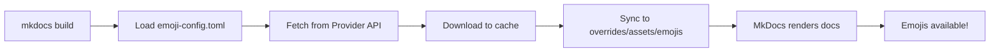

# MkDocs External Custom Emojis

> Sync custom emojis from external providers (Slack, Discord, etc.) into MkDocs Material


## Overview

Use your organization's custom Slack or Discord emojis directly in MkDocs documentation with the familiar `:emoji-name:` syntax.

Check out our party parrot: :partyparrot:

We love cats too: :catjam: :cat-dance: :meow_party:

## Key Features

- :material-sync: **Automatic Sync** - Emojis sync automatically during MkDocs build
- :material-shield-check: **Secure** - Tokens stored in environment variables, never in config files
- :material-database: **Smart Caching** - TTL-based caching to minimize API calls
- :material-puzzle: **Extensible** - Easy to add new providers (Teams, etc.)
- :material-folder-multiple: **Multiple Providers** - Support multiple Slack or Discord workspaces
- :material-filter: **Filtering** - Include/exclude emoji patterns
- :material-console: **CLI Tools** - Manage emojis with built-in CLI commands
- :material-wheelchair-accessibility: **Accessible** - Screen reader friendly with proper alt text

## Quick Example

=== "Configuration"

    ```toml title="emoji-config.toml"
    [[providers]]
    type = "slack"
    namespace = "slack"
    token_env = "SLACK_TOKEN"

    [[providers]]
    type = "discord"
    namespace = "discord"
    token_env = "DISCORD_BOT_TOKEN"
    tenant_id = "DISCORD_GUILD_ID"
    ```

=== "MkDocs Config"

    ```yaml title="mkdocs.yml"
    plugins:
      - external-emojis

    markdown_extensions:
      - pymdownx.emoji  # The plugin auto-configures this
    ```

=== "Usage"

    ```markdown
    # My Awesome Docs :slack-rocket:

    Custom emojis work everywhere:
    - In headings :slack-sparkles:
    - In lists :slack-check:
    - In tables :slack-table:

    !!! tip "Pro Tip :slack-lightbulb:"
        Use emojis to make your docs more engaging!
    ```

## How It Works



1. **Build Start** - MkDocs plugin activates
2. **Fetch Emoji List** - Provider API called (cached if fresh)
3. **Download Emojis** - Missing/stale emojis downloaded
4. **Sync to Icons Dir** - Emojis placed in `overrides/assets/emojis/<namespace>/`
5. **MkDocs Renders** - Material theme finds custom icons automatically

## Installation

```bash
pip install mkdocs-external-custom-emojis
```

Or with uv:

```bash
uv add mkdocs-external-custom-emojis
```

## Next Steps

<div class="grid cards" markdown>

- :material-clock-fast: **[Quick Start](getting-started/quickstart.md)**

    Get up and running in 5 minutes

- :material-cog: **[Configuration](getting-started/configuration.md)**

    Learn about all configuration options

- :material-console-line: **[CLI Commands](user-guide/cli.md)**

    Manage emojis from the command line

- :material-account-group: **[Contributing](development/contributing.md)**

    Help improve the project

</div>

## License

This project is licensed under the MIT License - see the [LICENSE](https://github.com/julie-dujardin/mkdocs-external-custom-emojis/blob/main/LICENSE) file for details.
